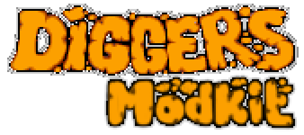

# Diggers Modkit

## Installation

* Install NodeJS >= 8.5.0
* Clone or download the repository
* `cd diggers-modkit`
* `npm i`

## Usage

### Unpack

To unpack the existing mod (or unpack the vanilla game files), simply run:

`node mod --unpack <path-to-game-dir>`

### Pack

To package the modified files, run:

`node mod --pack <path-to-game-dir>`
